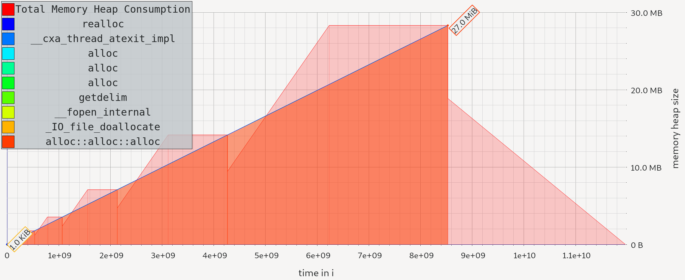
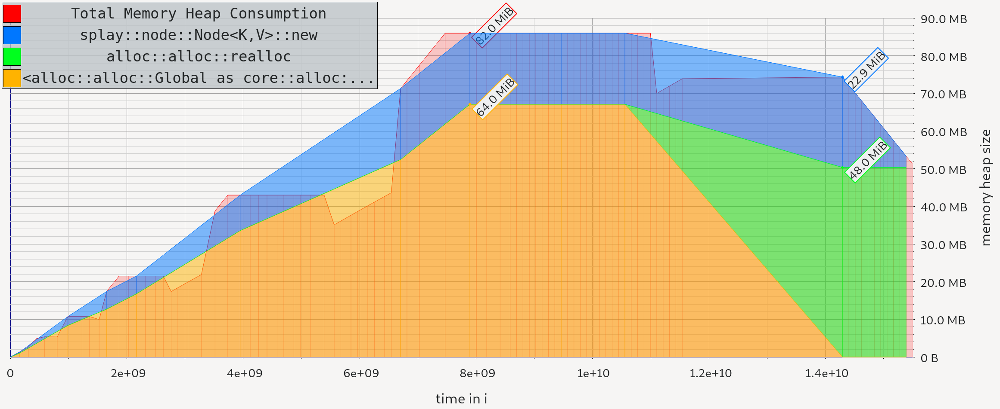

# splashmap

A toy hashmap which uses splay trees for separate chaining. Parts of splashmap's design and API are borrowed from the new [Rust hashbrown](https://github.com/rust-lang/hashbrown) in std.

### Introduction

This is an experiment for me to learn about how hashmaps work under the hood. The introduction of the splay tree for separate chaining adds an addtional `Ord` requirement on the keys of the hashmap.

### 100% collision benching

Here I run a doctored benchmark against [std HashMap](https://doc.rust-lang.org/std/collections/hash_map/struct.HashMap.html) with a custom hash function that intentionally only creates collisions, to verify that using a splaytree has some interesting effect on hash-colliding lookups:

### Memory

I use massif (`cargo build --examples && valgrind --tool=massif ./target/debug/examples/*`) and `massif-visualizer`.

`HashMap::new()`, insert 1,000,000 `<i32, i32>` pairs:

`SplashMap::new()`, insert 1,000,000 `<i32, i32>` pairs:

